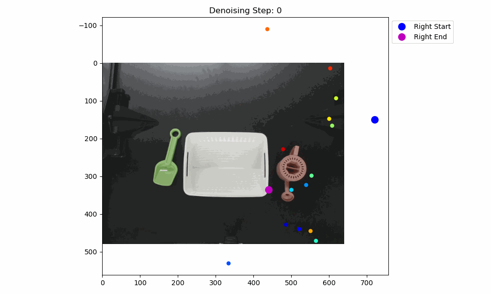

# Teaching-to-pack

This project is aim to explpore the efforts of deploying diffusion policy on aloha robots.
The task is to complete a packing scenscenario, such as the gif below.
The repo consists of the methods of analysing the collected data and mainly focuses on CNN-based and transformer-based diffusion policy.


<div align="center">
  
</div>


And the policy works in such way:



# Installation 

environment creation: 
```console
conda env create -f env_ttp.yaml
```
Clone the necessary repositories:

For the Aloha repository:
```console
cd Teaching_to_pack/src/aloha/
git clone https://github.com/tonyzhaozh/aloha.git
```
For the d3il_david repository: 
```console
cd Teaching_to_pack/src/d3il_david/
git clone https://github.com/joeyfreakman/d3il_david.git
git checkout real_robot
``` 
# Usage

## File system

```markdown
Teaching_to_pack
├── environment
│   ├── data             # Data saving folder 
│   ├── dataset          # Experiments of different datasets and dataloader which decrease I/O 
│   ...
├── scripts              # Functions for handling data
│   ├── data_compressor  # Code for compressing raw hdf5 data
│   ├── data_pruning     # Modifications on collected images
│   ├── spatial_position # Plot spatial trajectory of end effector
│   ...
├── src                  # Model and policy
│   ├── aloha            # Aloha robots' functions, data collection, and hyperparameters
│   ├── config           # Task configs and model hyperparameters
│   ├── core             # Core code for running the model
│   ├── d3il_david       # Transformer-based diffusion; refer to [d3il_david README](https://github.com/joeyfreakman/d3il_david/blob/real_robot/README.md)
│   ...
│   ├── model            # Vision encoder backbone and supporting functions
│   └── policy           # CNN-based diffusion policy for different format datasets
```


## run cnn-based policy 

modify the train.sh file to run the file u need
```console
cd ~/Teaching_to_pack/src/core
bash train.sh 
```

## run diffusion-based policy

For additional modifications, follow the instructions in the d3il repository:
```console
cd ~/Teaching_to_pack/src/d3il_david
python run.py
```
